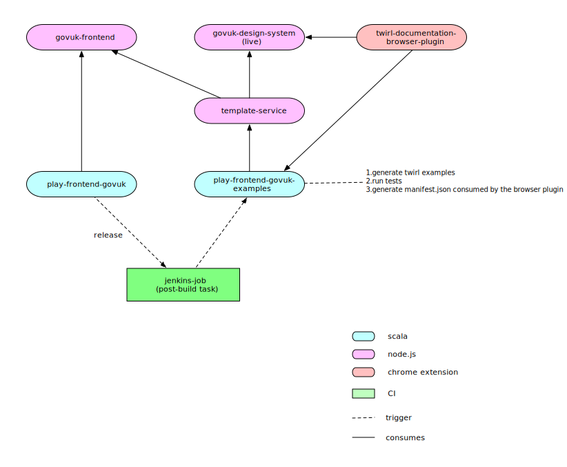

# play-frontend-govuk-examples

This repo is a dependency for the Google Chrome extension [play-frontend-govuk-extension](https://github.com/hmrc/play-frontend-govuk-extension).

The extension provides extra widgets for [design-system.service.gov.uk/components](https://design-system.service.gov.uk/components/).
Currently, this webpage acts as a manual for using GovUK components with HTML and Nunjucks examples.

The extension pulls in the Scala Twirl examples provided by this repo (translated from the Nunjucks examples).
This allows it to add an extra tab to each set of examples for using the Scala Twirl implemented by [play-frontend-govuk](https://github.com/hmrc/play-frontend-govuk)

## Prerequisites
First start up the `template-service-spike` NodeJS service according to the ReadMe in the relevant GitHub repo.

## Testing
Run the unit tests and ensure they pass before committing new changes by the below command:
```
sbt test
```

## Interface for Chrome extension
The [play-frontend-govuk-extension](https://github.com/hmrc/play-frontend-govuk-extension). repo traverses the directory structure of this repo published at [raw.githubusercontent.com](https://raw.githubusercontent.com).

To do this, it uses two URLs:
1) Examples root URL - the URL corresponding to the root directory for all Scala Twirl component example directories
2) Manifest URL - the URL for a manifest JSON file providing the URLs relative to the Examples root URL for each Scala Twirl component example.

Note that if the location of the root directory where Scala Twirl examples can be found or the manifest file, is changed; the corresponding update is needed in [play-frontend-govuk-extension](https://github.com/hmrc/play-frontend-govuk-extension).
Such changes will be breaking changes for the extension, and users will need to re-download the latest version of the extension source code.

## Committing changes
If any Scala Twirl examples are added or removed , the manifest JSON file will need to be regenerated.
This can be done by running the below:
```
sbt clean generateExamplesManifestTask
```
As a result, `manifest.json` would be amended - commit the changes to master when changes are ready to be deployed.

### Generating Example Templates (Future Work)
This can be done by running the below:
```
sbt 'run-main uk.gov.hmrc.govukfrontend.examples.ExampleGenerator'
```

### Generating & testing Example Templates
The examples need to be unit tested against the expected output `HTML` accompanying each example in the [GOV.UK Design System](https://design-system.service.gov.uk/components/)
to ensure the `Twirl` examples produce the same markup as the `Nunjucks` ones. <br/>
**_`Todo`_**: Use GET from /examples-output/$$COMPONENT_NAME$$ endpoint call in [template-service-spike](https://github.com/hmrc/template-service-spike) to retrieve html equivalent and compare

Once the examples have been created, an `sbt` task is manually run to generate a [manifest.json](src/test/resources/manifest.json)
file that is consumed by the [Chrome extension]((https://github.com/hmrc/play-frontend-govuk-extension)) to display the examples
in the [GOV.UK Design System](https://design-system.service.gov.uk/components/).

Ideally the following processes would be automated and wired up to run as a single process:
1. Generate the examples from the `Nunjucks` automatically (DONE)
2. Write automated tests using html from Template Service (TODO)
3. Generate the `manifest.json` for the `Chrome` extension (DONE)



TODO

### License

This code is open source software licensed under the [Apache 2.0 License]("http://www.apache.org/licenses/LICENSE-2.0.html").
