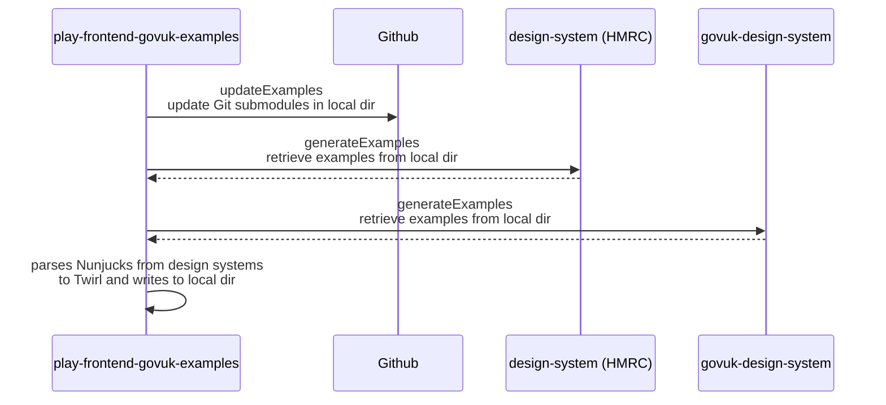

# play-frontend-govuk-examples

This repository is a dependency for the Google Chrome extension 
[play-frontend-govuk-extension](https://github.com/hmrc/play-frontend-govuk-extension), providing
Twirl examples for the Nunjucks components in the
[GOV.UK Design System](https://design-system.service.gov.uk/components/) and
[HMRC Design System](https://design.tax.service.gov.uk/).

The extension pulls in these examples and adds an extra tab to each set of 
examples showing how to use them with the Twirl library
[play-frontend-hmrc](https://github.com/hmrc/play-frontend-hmrc), which contains Play / Scala / Twirl implementations of
[govuk-frontend](https://github.com/alphagov/govuk-frontend) and [hmrc-frontend](https://github.com/hmrc/hmrc-frontend)

## Interface for Chrome extension

The [play-frontend-govuk-extension](https://github.com/hmrc/play-frontend-govuk-extension) repository traverses 
the directory structure of this repo.

To do this, it uses two URLs:
1) Examples root URL - the URL corresponding to the root directory for all Scala Twirl component example 
directories
2) Manifest URL - the URL for a manifest JSON file providing the URLs relative to the Examples root URL 
for each Scala Twirl component example.

Note that if the location of the root directory where Scala Twirl examples can be found or the manifest file,
 is changed; the corresponding update is needed in [play-frontend-govuk-extension](https://github.com/hmrc/play-frontend-govuk-extension).
Such changes will be breaking changes for the extension, and users will need to re-download the latest 
version of the extension source code.

## Unit testing

The unit tests test the Nunjucks parsing logic and perform some basic sanity checking on the Twirl examples.
They do not test the content of the rendered examples.

Before committing any new changes, ensure they pass by running,

```shell script
sbt test 
```

## Regenerating examples and committing changes

First, update the dependencies to play-frontend-hmrc by updating the `playFrontendHmrcVersion` val in
 [project/LibDependencies.scala](project/LibDependencies.scala)

Twirl examples are generated by translating the Nunjucks examples from alphagov/govuk-design-system and 
hmrc/design-system.

References to these repositories are stored in the form of git submodules.
You will want to first ensure these submodules are the latest available by the below command:

```shell script
git submodule update --init --recursive && \
git submodule update --remote
```

Alternatively, you can do this via an sbt task, which runs as a prerequisite to example generation:

```shell script
sbt updateExampleSources
```

Regenerate the examples by running the following command:

```shell script
sbt generateExamples
```

If all goes well, regenerate the manifest JSON file:

```shell script
sbt generateExamplesManifest
```

Then re-run the unit tests:

```shell script
sbt test
```

Due to limitations with the Nunjucks parser, it is possible you may find compilation issues with the
generated examples. In these cases, you will need to manually edit the generated examples in order to 
get them to compile.

To date, this has been found to be unfortunately the case for the following components:

* welshlanguagetoggle (example, exampleWelsh)
* signout (example)
* addtoalist (changeList, changeListWelsh, checkAnswers, checkAnswersWelsh)  
* checkboxes (withNoneOption, withNoneOptionInError)
* banner (example, exampleWelsh)

Additionally, there is an issue with a hardcoded asset path in the Nunjucks for `GovukHeader` that causes some issues 
with integration testing. There is a helper function in the `govukHeaderIntegrationSpec` to align the assets path at 
this time.

### Sequence diagram

The Twirl examples are generated from files in the latest versions of the [design-system](https://github.com/hmrc/design-system) 
and [govuk-design-system](https://github.com/alphagov/govuk-design-system) repos. `play-frontend-govuk-examples` does not
require any other services to be running for example generation.



### Integration testing

The integration tests, check that the generated Twirl examples generate the same markup as the Nunjucks 
examples in [GOV.UK Design System](https://design-system.service.gov.uk/components/) and
[HMRC Design System](https://design.tax.service.gov.uk).

First, clone and start up https://www.github.com/hmrc/x-govuk-component-renderer according to 
the instructions in the README. Then run,

```shell script
sbt it:test
```

For each example, the integration tests,

1. Render the Twirl example, using the govuk-frontend and hmrc-frontend versions specified in `AppDependencies.scala`
1. Render the Nunjucks example using the component renderer and the using versions of `govuk-frontend` and `hmrc-frontend` specified 
in the design system's `package.json`
1. Compare the Twirl output with the Nunjucks output

Due to the algorithm above, you may run into issues if the versions of https://www.github.com/alphagov/govuk-frontend or 
https://www.github.com/hmrc/hmrc-frontend used by https://www.github.com/hmrc/design-system differ from the versions 
 of hmrc-frontend and govuk-frontend associated with the play-frontend releases referenced above.
 
If this is the case, raise a PR with https://www.github.com/hmrc/design-system to get the dependencies on
 govuk-frontend and hmrc-frontend updated.

### License

This code is open source software licensed under the [Apache 2.0 License]("http://www.apache.org/licenses/LICENSE-2.0.html").
